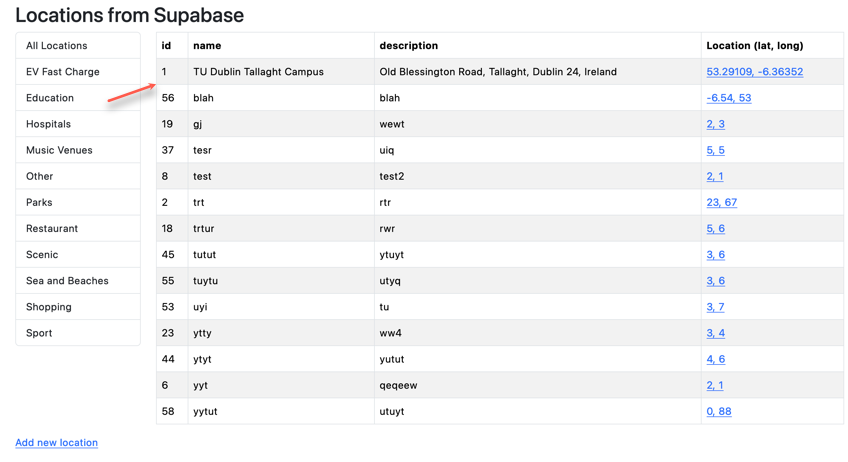
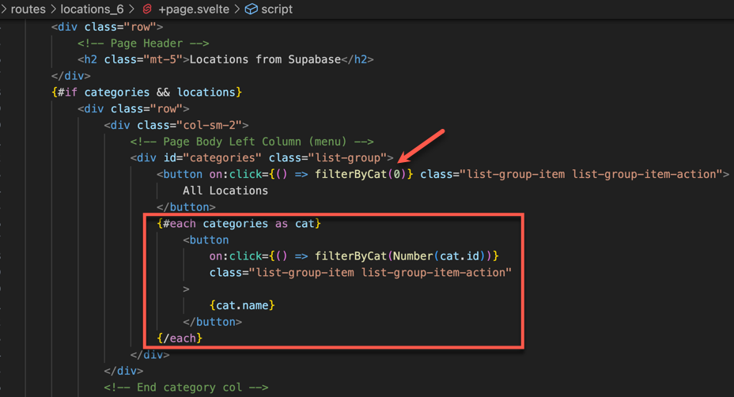
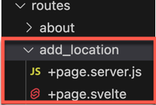
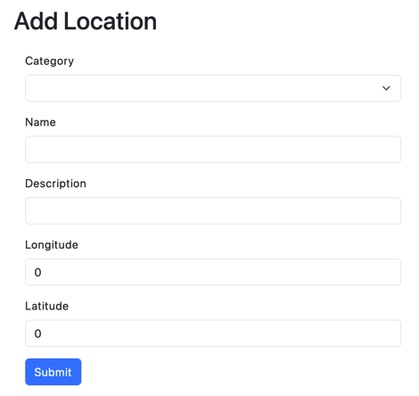
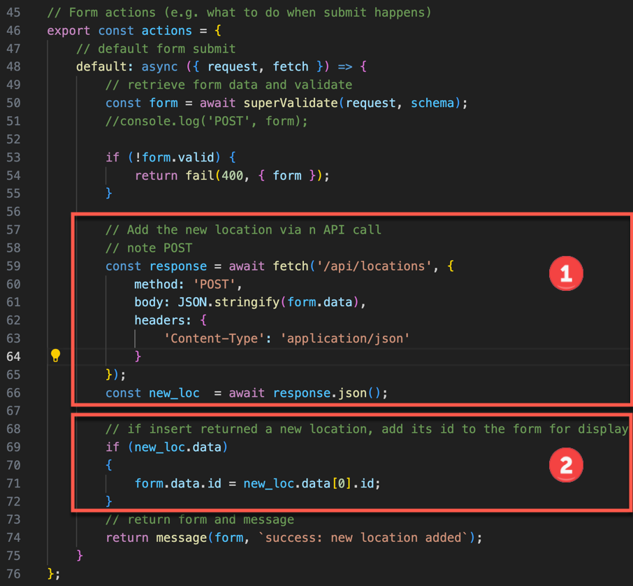
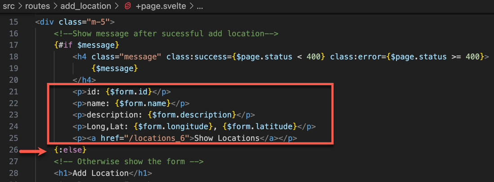
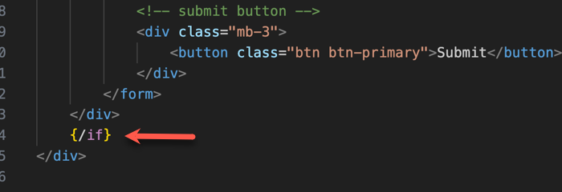

# Lab 6 - Using a Database in a Sveltekit Application

Enda Lee 2023

### Quick Start

1. Download the start site from this repository.
2. Open in VS Code.
3. In a terminal run `npm install`.
4. Start the application using `npm run dev`.

This repository includes solution to the previous lab exercises. 

**You will need to add `.env` (base it on `.env.example`) and set your API keys, etc.**


## Introduction

This lab builds on the previous example, you will be adding the following features

1. Improving the method used to access Supabase data.
2. Filtering of locations by category.
3. Adding new locations via a form.


## 1. Using API endpoints to access Supabase

The labs 5 locations page (see **[/locations_5]()**) fetched the locations data directly from Supabase in the route via its `+page.server.js` script. 

While this works fine, accessing the data store directly in endpoints may lead to problems as tyhe application grows in complexity. For example, if we need to change the database or move to another platform.

A solution is to access the data via `api endpoints` defined elsewhere in the application. In this example you wil find them in `/routes/api`

The following endpoints are defined:

1. `/api/locations` to **GET** all locations.
2. `/api/locations/category/[cat_id]` to **GET** all locations in a particular category.
3. `/api/locations` to **POST** a new location which will be added to the database
4. `/api/categories` to **GET** all categories.

Note that the `HTTP Method` defines the type of operation so **GET** is used to **read** data and **POST** is used to **create** a new record. This follows `RESTful` API design principles.

For example `/api/locations/+server.js` Defines the following **GET** functions: 

```javascript
import { json } from '@sveltejs/kit';

// import the client instance (created earlier)
import {supabase} from "$lib/supabase.js";

// Get all locations
export async function GET({ request, cookies }) {

    // Query data
    const locations = await supabase
    .from('locations')
    .select('*');

    if (locations.error) {
        return json({
            status: locations.status,
            error: locations.error
        });
    }

    return json({
        data: locations.data,
        status: locations.status
    });
}
```

This function is called via  `fetch()` in `+page.server.js` in the `/locations_6` route. The main difference from the lab5 solution is the removal of data access code from the page. 

```javascript
        // Call fetch
        const res_locations = await fetch('/api/locations');

        // if resonse code 200 (ok)
        if (res_locations.ok) {
            // get json from resonse
            locations = await res_locations.json();
        }
```


**Exercise: examine the other API `GET` endpoints and see how they are used by `fetch` in  the `/locations_6` route**


## 2. Filtering of locations by category

This is a view of the [/locations_6]() page. It displays a list of categories and a table of locations. This is a re-worked solution to lab 5. 



Clicking a location (these are buttons) will display the locations for that category. To acieve this, an `on:click` handler is attached to each category button in the `{#each}` loop used to generate the list.

 


The `id` for each `category` is written as the click function parameter in the loop. Note that an `anonymous` or `inline` function `() => {}` must be used in the `on:click` to set a parameter.

```javascript
on:click={() => filterByCat(Number(cat.id))}
```

The `filterByCat()` function is defined in the `<script>` block. Its job is to call the API to get locations by category via a **fetch** for `/api/locations/category/[cat_id]` . If `id == 0` then it gets and returns all locations.

```javascript
	/**
	 * @param id {number}
	 */
	async function filterByCat(id) {
		let endpoint = '/api/locations/';

		if (id != 0) {
			endpoint = `${endpoint}category/${id}`;
		}
		console.log('api endpoint: ', endpoint);
		// Call fetch
		const response = await fetch(endpoint);
		// if resonse code 200 (ok)
		if (response.ok) {
			// get json from resonse
			const json = await response.json();
			locations = json.data;
		}
	}
```

**Exercise: examine the HTML layout in this page**


## 3. Adding new locations via a form

It this section you will:

1. Add a new form and the script to process it.

2.  use a form to enter the values for a new location and submit them to the server.

3. Validate the input values, and call an API endpoint  to add the new location.

4. Display the result.

   

### 3.1. Add a route to `/add_location` and the form

Add a folder for the new route the add the usual `+page.server.js` and `+page.svelte` files



The finished form should look like this:



To create it, we will use a Sveltkit library called **Superforms** which provides a set of functions to make for processing easier. It also uses **Zod** for validation for details about the library see https://superforms.rocks/

1. Use `npm` to install the dependencies

   ```bash
   npm install -D sveltekit-superforms zod
   ```

2. open `+page.server.js` for editing.

3. Import the required dependencies

   ```javascript
   // import dependencies
   // Zod: validator
   // superforms: form helper
   import { fail } from '@sveltejs/kit';
   import { z } from 'zod';
   import { superValidate, message } from 'sveltekit-superforms/server';
   ```

   

4. Define a `Superforms` schema for the add locations form. This will be used to generate the form fields and validation later. Note that this is a simple example with basic validation, to get started. The `schema` object defines each location property. `id` is optional as it will not be available until ater the new location is added to the database.  

   ```javascript
   const schema = z.object({
       id: z.number().optional(),
       category_id: z.number(),
       name: z.string(),
       description: z.string(),
       longitude: z.number(),
       latitude: z.number()
   });
   ```

5. The next step is to generate the form in the  `load()` function in `add_location/+page.server.js` so that it can be displayed in the page. Note too that the `categories` are fetched from the API as they are required for the form.

   ```javascript
   // Page load
   // Build the form and returns to page
   export async function load({ fetch, params }) {
       // Build form
       const form = await superValidate(schema);
   
       // Get categories (to display in a select list in the form)
       let categories;
       const response = await fetch('/api/categories');
   
       // if resonse code 200 (ok)
       if (response.ok) {
           // get json from resonse
           categories = await response.json();
       }
   
       // Return form and categories
       return {
           form,
           categories: categories.data,
       };
   }
   ```


At this point everything required to generate the form has been sent to the page. The next tep is to build the form

1. Open `+page.svelte` for editing. 

2. Access the form and data (from `+page.server.js`) in the `+page.svelte`  `<script>`.

   ```javascript
   <script>
   	/** @type {import('./$types').PageData} */
   
   	// dependencies
   	import { page } from '$app/stores';
   	import { superForm } from 'sveltekit-superforms/client';
   
   	export let data;
   
   	// create form instance
   	const { form, errors, enhance, delayed, message, constraints, reset } = superForm(data.form);
   </script>
   ```

   

3. The form istelf is styled using Bootstrap 5.

   Note the `Sveltekit` and `Superforms` annotations@

   * Show `$message` if it exists. This is returned after successful form submission.
   * `use:enhance` on the `<form>` element. This can be used for client-side validations (not yet enabled in this example)
   * The `bind:value` on each input which binds the form to the `$form` instance. Node the `$` is import as this object is defined as a Svelte `store`.
   * The `select` element is bound to `$form.category_d` and filled with category options using an `{#each}` loop. 

   ```html
   <div class="m-5">
     <!--Show message after sucessful add location-->
   	{#if $message}
   		<h4 class="message" class:success={$page.status < 400} class:error={$page.status >= 400}>
   			{$message}
   		</h4>
   	{/if}
   
   	<h1>Add Location</h1>
   	<!-- Bootstrap Form Layout-->
   	<div class="w-75 mw-300 p-3">
   		<!-- this form will post when submitted -->
   		<form method="POST" use:enhance>
   			<div class="mb-3">
   				<label for="category_id" class="form-label">Category</label>
   				<select name="category_id" bind:value={$form.category_id} class="form-select">
   					<option value="0">Choose a category</option>
   					<!-- Add each category to the select -->
   					{#each data.categories as cat}
   						<option value={cat.id}>{cat.name}</option>
   					{/each}
   				</select>
   			</div>
   
   			<!-- name -->
   			<div class="mb-3">
   				<label for="name" class="form-label">Name</label>
   				<input type="text" name="name" class="form-control" bind:value={$form.name} />
   			</div>
   
   			<!-- description -->
   			<div class="mb-3">
   				<label for="description" class="form-label">Description</label>
   				<input type="text" name="description" class="form-control" bind:value={$form.description} />
   			</div>
   
   			<!-- longitude -->
   			<div class="mb-3">
   				<label for="longitude" class="form-label">Longitude</label>
   				<input type="text" name="longitude" class="form-control" bind:value={$form.longitude} />
   			</div>
   
   			<!-- latitude -->
   			<div class="mb-3">
   				<label for="latitude" class="form-label">Latitude</label>
   				<input type="text" name="latitude" class="form-control" bind:value={$form.latitude} />
   			</div>
   
   			<!-- submit button -->
   			<div class="mb-3">
   				<button class="btn btn-primary">Submit</button>
   			</div>
   		</form>
   	</div>
   </div>
   ```

### 3.2. Processing the form data

At this stage the form will display but not submit as it needs an `action handler` - a function which can accept the form data via an `HTTP POST`.

Actions are definded for the route in `add_location/+page.server.js`. Add this **after the `load()` function** defined earlier:

```javascript
// Form actions (e.g. what to do when submit happens)
export const actions = {
    // default form submit
    default: async ({ request, fetch }) => {
        // retrieve form data and validate
        const form = await superValidate(request, schema);
        
      	console.log('POST', form);

        if (!form.valid) {
            return fail(400, { form });
        }

        // return form and message
        return message(form, `success: new location added`);
    }
};
```

At this point it the handler validates the input using the schema rules and then either displays the form again or a success message.

### 3.3. Adding the new location to the database

This step involves calling the API via a `POST` request and passing the new location data in the `request.body` as `JSON`

The `POST` `endpoint` is **already defined in `/api/locations/+server.js`** and does the following:

* Read data from the request body.
* Call Supabase.
* Return the newly created location, including the id (important for later).

The `endpoint` is accessed via  `fech()` in the form handler using the following code

1. The first code block is the `fetch()`. This is different from the usual (default) `GET` version:

   * The HTTP `method` is set to `POST` as this request includes bidy data.

   * The form data is added to the request  `body`.

   * `headers` are set to let the server know that the `body` contains `JSON` data.

     

2. The second code block check if the `fetch` returned a new `location` and adds the new `id` to the `form` object.



The form and message are returned for display at the end.


### 3.4. Display the result

At this point the new location has been inserted so a confirmation can be displayed in `+page.svelte`

To do this, modify the existing message display to include the location data. The form can also be hidden - using the `{:else}` block.



Don't forget to end the `{/if}` at the bottm of the page, after the form.




## 4. Exercices

1. Modify the `add_location` form so that it includes the properties left out in this example.
2. Add an API endpoint `/api/locations/[id]` to get locations by id.
3. Add a form to add new categories.
   
Note: if you see errors about the primary key (id) value already in use, reset the Postgres identidy sequence for the table in SQL Editor:

```sql
ALTER SEQUENCE location_category_id_seq RESTART WITH 20;
```

------

*Enda Lee 2023*
